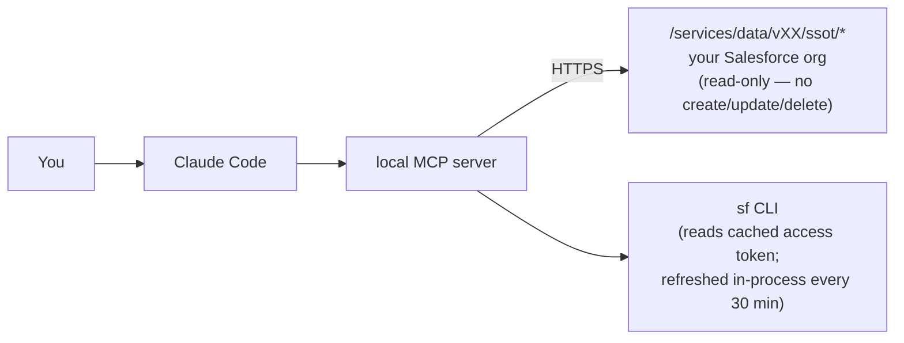

# Data360 Analyst

A read-only toolkit for understanding Salesforce Data Cloud orgs. Built for [Claude Code](https://docs.anthropic.com/en/docs/claude-code) — ask questions about your org in plain English and get architecture analysis, SQL audits, and documentation without clicking through Setup or writing throwaway SOQL.

Most Data Cloud tooling is for builders — admins shipping segments, activations, and integrations. This toolkit is for the other half of the job: **understanding what's already been built, finding architectural issues, and documenting findings for review.** Designed for technical architects, data engineers, and consultants who walk into existing orgs and need to come up to speed quickly.


## Quick start

```bash
git clone https://github.com/jmatos-sfdc/data360-analyst
cd data360-analyst
python3 -m venv .venv
.venv/bin/pip install -r requirements.txt

# Authenticate to a Data Cloud org (one-time per org)
sf org login web --instance-url https://<your-instance>.my.salesforce.com --alias <alias>

# Register the MCP server with Claude Code
claude mcp add data360 \
    "$(pwd)/.venv/bin/python" \
    "$(pwd)/mcp_server.py" \
    --org <alias>
```

That's it. Open Claude Code and start asking questions. The toolkit ships with a `CLAUDE.md` and [Skills](https://docs.anthropic.com/en/docs/claude-code/skills) that teach Claude how to use every tool — you don't need to learn the CLI flags or script names.

### Verify it works

Try these prompts to confirm the MCP server is wired up:

| Prompt | What you should see |
|---|---|
| *"List the DMOs in this org."* | A list with at least the standard `ssot__*__dlm` objects |
| *"How many Calculated Insights exist?"* | A count and a sample of names |
| *"Show me the SQL for the first CI."* | A multi-line SQL block (HTML-decoded) |
| *"Count rows in `ssot__Individual__dlm`."* | A SQL job handle, then a single row with the count |

If any of these fail, see [Troubleshooting](#troubleshooting).

## What it looks like

Once the MCP server is registered, conversations look like this:

**Walk into an unfamiliar org**

> **You:** "I just got access to this Data Cloud org. Which DMOs are most heavily used — i.e. read by the most CIs and segments?"
>
> Claude calls `list_dmos`, then `list_cis` for the SQL, parses each `expression`, ranks by fan-in.
>
> "Top 5 by CI/segment edges: `Account__dlm` (26 reads), `Individual__dlm` (24), `SalesOrder__dlm` (18)… The top two are dimensional (account/individual style); the rest look transactional. Want me to drill into any of them?"

**Audit a CI's SQL**

> **You:** "Pull the SQL for `Customer_Lifetime_Value__cio` and look for hard-coded IDs, duplicate-causing joins, or anything that would break on a sandbox refresh."
>
> Claude calls `get_ci_metadata`, decodes the HTML-encoded `expression`, scans for issues.
>
> "Two issues: (1) `RecordTypeId = '0123x000000ABCDAA2'` hard-coded on line 47 — that ID changes on sandbox refresh and will silently break this CI. (2) The join to a parent-hierarchy table is many-to-many, fanning out duplicate output rows for accounts with more than one parent record."

**Iterative drill-down**

> **You:** "What CIs read from `Purchase_History__dlm`?"
>
> Claude returns the list, grouped by naming prefix.
>
> **You:** "Show me the SQL for the three with the same prefix — I want to compare their classification logic side by side."
>
> Claude pulls each CI's expression, diffs the WHERE clauses.
>
> **You:** "Are any of these likely abandoned? Look for `_CLONE`, `_TEST`, or version suffixes."

**Snapshot and generate a dashboard**

> **You:** "Run an intake of this org, then generate the dashboard."
>
> Claude runs `intake.py` to export the full org to disk, then `dmo_graph.py` and `ci_audit.py` for analysis, then `dashboard.py` to assemble a single-page HTML dashboard with charts. One shareable file, no JavaScript.

## What it surfaces

The value of an audit toolkit is in *findings*, not minutes saved. Real examples from production engagements:

**Hard-coded IDs that break on sandbox refresh.** In one org's account-hierarchy CI, a `RecordTypeId` literal appeared three times in the SQL. RecordType IDs do not survive a refresh from a different source org — the CI silently returns zero rows post-refresh. Caught by reading the SQL pulled via `intake.py`.

**Many-to-many joins fanning out duplicates.** Same CI joined a self-referential account hierarchy without dedup defense. Three duplicate parent records upstream produced 59 duplicate output rows (all identical post-projection — no way for a downstream consumer to detect). The CI body was 80 lines; the duplicate count surfaces immediately when you read the SQL alongside the row distribution.

**Lifecycle filters quietly missing.** 250 `Closed` and 3 `AD Retired` accounts flowing through a hierarchy CI with no filter — every downstream segment built on it inherits the leak.

**Architectural drift across CIs.** In another org, eight CIs each carried their own copy of the same account-prefix exclusion logic. Should have been centralized in a single master transform; was instead duplicated across files written months apart by different builders. Flagged by clustering CIs that read from the same DMO and diffing their `WHERE` clauses.

**Abandoned dev artifacts.** `*_CLONE` suffixes, developer-initial prefixes, version-numbered duplicates (`_v2`, `_old`) sitting active in production. One quick sweep of the CI inventory turns them up.

**What `ci_audit.py` checks automatically (AST-based, not regex):**
- Single-day trigger equality — `col = date_add(current_date(), -N)` is a one-bad-run-and-you-miss-the-day pattern
- Leap-year bug — `MONTH(col) = MONTH(CURRENT_DATE) AND DAY(col) = DAY(CURRENT_DATE)` silently skips Feb-29 birthdays
- `CURRENT_DATE()` UTC drift — flags every call site for review against late-day US-timezone events
- Missing unsubscribe suppression — flags marketing CIs without a `LEFT JOIN` to `*_Unsubscribes__dlm`
- Dedup window grain — reports every `row_number() OVER (PARTITION BY ...)` so you can confirm the partition keys match intent

**What you get out of one snapshot run.** On a recent engagement (278 DMOs, 178 CIs, 76 segments), one `intake.py` run plus a `ci_audit.py` pass produced: a fan-in graph identifying the 5 backbone DMOs (read by 30+ CIs each), a Lucidchart diagram cross-check flagging 12 documented-but-not-deployed CIs, and an HTML dashboard suitable for a client readout. End to end: about 30 minutes. Manually clicking through Setup to assemble the equivalent: days.

The toolkit does not measure how fast you build. It measures what's already broken, undocumented, or drifted — the things a typical Setup walkthrough will not surface.

## Skills

The toolkit ships with Claude Code Skills that let you invoke specific workflows by name:

| Skill | What it does |
|---|---|
| `/data360-analyst` | Full org analysis — orchestrates intake, audit, exploration, and documentation |
| `/data360-intake` | Snapshot a Data Cloud org to disk (YAML sidecars + raw SQL) |
| `/data360-ci-audit` | Audit CI SQL for known correctness traps |
| `/data360-ci-author` | Write CI SQL with editor constraints and supported function patterns |
| `/data360-sql-convert` | Convert Query Editor SQL to CI editor-compatible SQL |
| `/data360-architecture` | DMO fan-in ranking, CI clustering, diagram cross-check |
| `/data360-compare` | Diff CIs side-by-side, compare DMO schemas across orgs |
| `/data360-segment-decode` | Decode segment criteria trees, validate membership |
| `/data360-client-report` | Assemble findings into a client-shippable deliverable |
| `/data360-transform-audit` | Audit Data Transform DAGs — dedup grain, formula patterns |
| `/data360-dpe-review` | Review DPE/Data Action configurations — field mappings, upsert keys |
| `/data360-html-export` | Generate a single-page HTML dashboard from all reports |
| `/data360-setup` | Install dependencies, register MCP server, add a new client |

## MCP tool catalog

The skills above are the high-level workflows. Underneath, the MCP server exposes 16 read-only tools that Claude calls directly. You normally won't invoke these by name — but if you're writing your own agent or want to check what's available:

| Group | Tools |
|---|---|
| **DMOs** | `list_dmos`, `get_dmo`, `get_dmo_relationships` |
| **Calculated Insights** | `list_cis`, `get_ci_metadata`, `run_ci` |
| **Data Transforms** | `list_transforms`, `get_transform` |
| **Data Processing Engine** | `list_dpes`, `get_dpe` |
| **Streams** | `list_streams` |
| **Segments** | `list_segments` |
| **Activations** | `list_activations` |
| **Identity Resolution** | `list_ir_rulesets` |
| **SQL** | `run_sql`, `get_sql_rows` |

All tools are read-only — there are no `create_*`, `update_*`, or `delete_*` tools by design. The Data Cloud SQL engine itself rejects anything other than `SELECT` on `run_sql`.

## What's under the hood

You don't need to run these scripts directly — Claude does it for you — but here's what the toolkit includes:

- **`intake.py`** — Exports every DMO, CI, transform, segment, stream, and activation as YAML sidecars + raw SQL/JSON definitions. Diff-friendly, version-controllable, grep-able.
- **`ci_audit.py`** — Parses each CI's SQL with `sqlglot` and checks for known correctness traps: leap-year bugs, single-day trigger equality, missing unsubscribe suppression, dedup window grain.
- **`dmo_graph.py`** — Ranks DMOs by fan-in (how many CIs and segments read from them) to identify backbone vs. leaf objects.
- **`cluster_cis_by_dmo.py`** — Zooms into one DMO and clusters the CIs built on it by naming pattern, join shape, and output measures.
- **`diagram_crosscheck.py`** — Reads a Lucidchart canonical pipeline diagram (Document JSON export) and matches its labels against the on-disk inventory. Flags orphans on both sides.
- **`dashboard.py`** — Assembles all reports and YAML sidecars into a self-contained, tabbed HTML page with inline SVG charts. No JavaScript, no external dependencies.
- **`mcp_server.py`** — [FastMCP](https://github.com/jlowin/fastmcp) server exposing read-only `/ssot/*` REST endpoints so Claude can query the org live.

### Using the CLI directly

If you prefer running the scripts yourself (for batch snapshots, CI pipelines, or non-Claude workflows):

```bash
source .venv/bin/activate

# Export the whole org to disk
python intake.py --org <alias> --output-dir ~/data360/<client>

# Audit every CI's SQL
python ci_audit.py --output-dir ~/data360/<client>

# Rank DMOs by fan-in
python dmo_graph.py --org <alias> --output-dir ~/data360/<client>

# Cross-check against a Lucidchart diagram
python diagram_crosscheck.py --diagram /path/to/diagram.json \
                             --output-dir ~/data360/<client>

# Generate the HTML dashboard
python dashboard.py --data-dir ~/data360/<client> --client "<client>"
```

## How it works

Here's how a request flows:



**Auth:** The toolkit never stores credentials. It shells out to `sf org display` to get a fresh access token, reusing the OAuth session you already established with `sf org login web`. Your Salesforce permissions are the only permissions the toolkit has.

**MCP server:** `mcp_server.py` exposes the org's Data Cloud REST endpoints as MCP tools — `list_dmos`, `get_ci_metadata`, `list_segments`, `run_sql`, etc. Read-only by design: no create/update/delete tools, and the Data Cloud SQL engine itself rejects anything other than `SELECT`.

**Scripts:** The REST APIs return raw artifacts (CI SQL is HTML-entity-encoded; transform DAGs are deeply nested JSON). The Python scripts decode, parse, and produce YAML sidecars, markdown reports, raw `.sql` files, and the HTML dashboard.

## Output structure

```
<output-dir>/
├── object-model.md                Narrative summary, human-readable
├── object-model/
│   ├── index.yaml                 Org rollup (alias, instanceUrl, counts)
│   ├── dmos/<name>.yaml           Per-DMO schema
│   ├── cis/<name>.yaml            Per-CI metadata
│   ├── transforms/<name>.yaml     Per-transform metadata
│   ├── streams/<name>.yaml        Per-stream metadata
│   └── segments/<name>.yaml       Per-segment metadata
├── queries/<name>.sql             Per-CI SQL body (HTML-decoded)
├── transforms/<name>.json         Per-transform definitions DAG (HTML-decoded)
└── reports/                       Audit findings + dashboard
    ├── dmo-graph.md
    ├── ci-audit.md
    ├── diagram-crosscheck.md
    └── dashboard.html             Single-page tabbed dashboard with SVG charts
```

## Status

Personal toolkit, used in production on real consulting engagements. Public release is to make it easier to share with peers and accept contributions, not because it's polished. Expect rough edges:

- Lucidchart `diagram_crosscheck.py` matcher does not handle abbreviation-style aliases (`CustLTV`/`Customer_Lifetime_Value`); add per-engagement substitutions inline if needed.
- Streams-to-DMO lineage is not graphed (the DLO-to-DMO mapping is not exposed by the public API).
- All client-specific findings live in your `<output-dir>` — the toolkit itself stays generic.

## Troubleshooting

| Problem | Cause & fix |
|---|---|
| `sf org display failed` | Your sf CLI session for `<alias>` has expired. Run `sf org login web --instance-url <url> --alias <alias>` to refresh. |
| `Org does not support API v64.0+` | The org's API version is below v64. Data 360 Connect endpoints require v64.0 minimum. Contact your Salesforce admin to upgrade the org's API version, or test against a newer sandbox. |
| MCP server not appearing in Claude Code | Run `claude mcp list` to confirm registration. If absent, re-run the `claude mcp add` command from Quick Start. The path to `python` and `mcp_server.py` must be absolute. |
| `403 Forbidden` from `/ssot/*` endpoints | The authenticated user lacks Data Cloud permissions. Assign the **Customer Data Platform Admin** permission set in Setup → Permission Sets. |
| `_error: 401` mid-session | Cached token expired and the in-process refresh failed. Restart Claude Code so the MCP server re-launches and re-authenticates. |
| `intake.py` writes nothing to `output-dir` | Check that the alias has Data Cloud enabled and that the org has at least one DMO/CI/segment. The script logs each artifact category as it writes. |
| `ci_audit.py` reports zero CIs | Run `intake.py` first — `ci_audit.py` reads from `<output-dir>/queries/`, not the live org. |
| Dashboard renders blank tabs | One of the input files (`object-model/index.yaml`, `reports/dmo-graph.md`, etc.) is missing. Re-run `intake.py` and `dmo_graph.py` before `dashboard.py`. |

## License

Apache License 2.0 — see [LICENSE](LICENSE).

## Acknowledgements

Built on top of [`sqlglot`](https://github.com/tobymao/sqlglot), [`fastmcp`](https://github.com/jlowin/fastmcp), and the Salesforce CLI.
