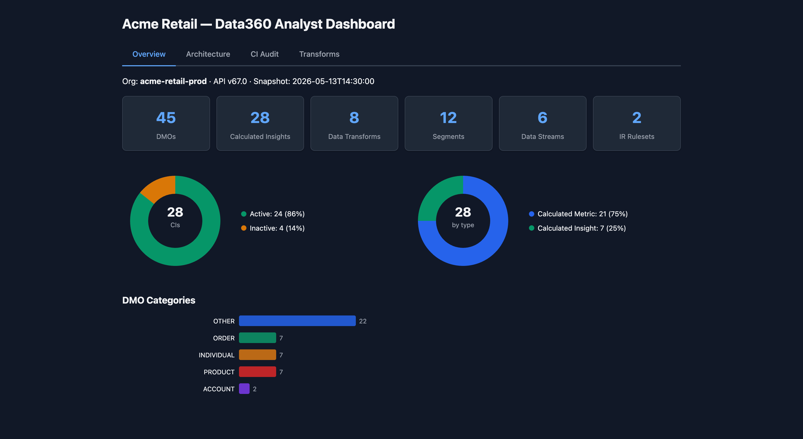
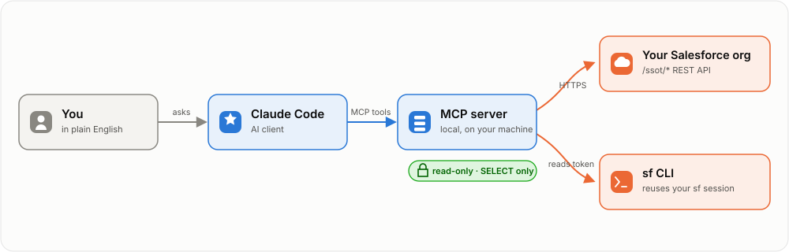
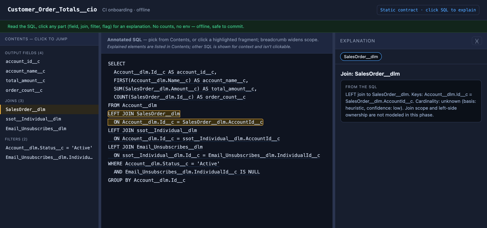
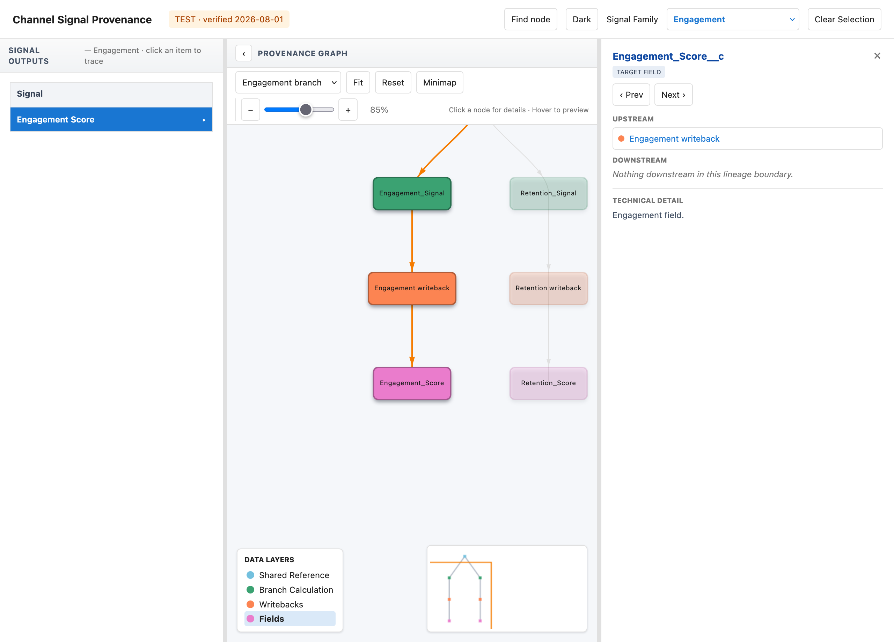

# Data360 Analyst

A read-only toolkit to analyze, audit, and document Salesforce Data 360 orgs by asking questions in plain English — architecture analysis, SQL audits, and lineage, without clicking through Setup or writing throwaway SOQL. Built for [Claude Code](https://docs.anthropic.com/en/docs/claude-code).

Most Data 360 tooling is for builders — admins shipping segments, activations, and integrations. This toolkit is for the other half of the job: **understanding what's already been built, finding architectural issues, and documenting findings for review.** Designed for technical architects, data engineers, and consultants who walk into existing orgs and need to come up to speed quickly.



## New here? Start on the paved path

1. **See it work, no org, no auth** — `./setup.sh && .venv/bin/data360 demo` (30 seconds — [below](#try-it-in-30-seconds--no-org-no-auth)).
2. **Point it at your org** — authenticate, then `data360 analyze <alias>` prints the high-value answers straight to your terminal ([Quick start](#quick-start)).
3. **Ask in plain English** — register the MCP server and drive the whole toolkit from Claude Code ([Quick start](#quick-start)).
4. **Persist and share** — `data360 intake` snapshots the org to disk; `data360 dashboard` builds a shareable single-file HTML report.

**Contents:** [Try it in 30s](#try-it-in-30-seconds--no-org-no-auth) · [Why it's different](#why-its-different) · [Quick start](#quick-start) · [What it looks like](#what-it-looks-like) · [What it surfaces](#what-it-surfaces) · [Interactive reports](#interactive-reports) · [Skills](#skills) · [MCP tools](#mcp-tool-catalog) · [CLI reference](#using-the-cli-directly) · [How it works](#how-it-works) · [Troubleshooting](#troubleshooting)

## Try it in 30 seconds — no org, no auth

```bash
git clone https://github.com/jmatos-sfdc/data360-analyst
cd data360-analyst
./setup.sh
.venv/bin/data360 demo
```

`data360 demo` runs the full analysis pipeline — SQL audit, lineage graph, dashboard — against a bundled synthetic org snapshot (`examples/demo-org/`) and opens a self-contained HTML dashboard. No Salesforce org, no authentication, no Claude required.

The `data360` command is a standalone CLI. The [Claude Code](https://docs.anthropic.com/en/docs/claude-code) skills and MCP server described below are an *optional* layer on top — use them to ask questions in plain English against a live org, or run the CLI directly in a script or CI pipeline.

## Why it's different

- **The whole org in context, at once.** `intake.py` snapshots every DMO, CI, transform, stream, segment, and activation to local files, so Claude can reason across the entire object model in one pass — trace lineage, spot duplicated logic, find every CI that touches a field. The Data 360 app shows one object at a time with no cross-object search; there is no screen where you see it all.
- **Two layers of data safety, not one.** The MCP server is read-only by construction — no `create`/`update`/`delete` tools, and the SQL engine rejects anything but `SELECT`. On top of that, the shipped `CLAUDE.md` and skills instruct the model to keep customer row-level data out of its context: it works from metadata and aggregates, not individual records. Safe to point at production, and appropriate for engagements under a data-processing agreement.
- **Diff-able, version-controllable snapshots.** Intake output is plain YAML + raw `.sql` on disk. `git diff` a snapshot against the prior one to see exactly what changed in an org before and after a deploy; use `/data360-compare` for a structured schema diff across two different orgs (sandbox vs. prod) — comparisons the UI can't give you.
- **Offline, self-contained artifacts.** The dashboard, CI Visualize, and provenance reports are single HTML files with no org connection and no row-level data — hand one to a stakeholder who has no Data 360 license.
- **Your permissions, no stored credentials.** It reuses your existing `sf` CLI session, so the toolkit has exactly the access you do and never persists a secret.

### Manual walkthrough vs. this toolkit

| Task | Setup UI / SOQL by hand | `data360-analyst` |
|---|---|---|
| Understand the whole object model | Click object-by-object through Setup, no cross-object search | One `intake` snapshot; the entire model on disk, greppable |
| Find every CI that reads a field | Open and read each CI manually | One question in Claude Code, or `dmo-graph` fan-in ranking |
| Compare sandbox vs. prod | Click through Setup in both orgs, eyeball differences | `/data360-compare` diffs DMO schemas across orgs |
| Spot drift after a deploy | Remember what it looked like before | `git diff` a snapshot against the prior one |
| Catch broken sandbox IDs / dedup bugs | Read every CI's SQL by eye | `ci-audit` — AST checks, self-verifying SQL snippets |
| Hand a stakeholder a readout | Screenshots, slide deck | One self-contained HTML dashboard, no license needed |
| **Time to first findings** | **Hours to days** | **~30 minutes** |

## Quick start

Before you install, here's the whole request path — you ask in plain English, Claude Code calls the local read-only MCP server, which reads a token from your `sf` CLI session and queries your org's read-only `/ssot/*` REST API over HTTPS:



```bash
git clone https://github.com/jmatos-sfdc/data360-analyst
cd data360-analyst
python3 -m venv .venv
.venv/bin/pip install -e .

# Authenticate to a Data 360 org (one-time per org)
sf org login web --instance-url https://<your-instance>.my.salesforce.com --alias <alias>

# Register the MCP server with Claude Code. Name it d360-<alias> — the d360-
# prefix keeps it distinct from the `data360` CLI command, and the org alias
# suffix lets you register one server per org (e.g. d360-prod, d360-uat).
claude mcp add d360-<alias> \
    "$(pwd)/.venv/bin/python" \
    -m data360_analyst.mcp_server \
    --org <alias>
```

That's it. Open Claude Code and start asking questions. The toolkit ships with a `CLAUDE.md` and [Skills](https://docs.anthropic.com/en/docs/claude-code/skills) that teach Claude how to use every tool — you don't need to learn the CLI flags or script names.

To run the `data360` command yourself (see [Using the CLI directly](#using-the-cli-directly)), activate the virtualenv first — `source .venv/bin/activate` — or call `.venv/bin/data360` directly. It isn't installed globally.

Want `data360` on your PATH everywhere without activating a venv? Use [pipx](https://pipx.pypa.io/) instead of the venv steps above — it installs into its own isolated environment and just exposes the command:

```bash
pipx install -e .
data360 --help
```

### Verify it works

Start Claude Code (`claude`) in the directory where you registered the server, then type these prompts to it — they confirm the MCP server is wired up:

| Prompt | What you should see |
|---|---|
| *"List the DMOs in this org."* | A list with at least the standard `ssot__*__dlm` objects |
| *"How many Calculated Insights exist?"* | A count and a sample of names |
| *"Show me the SQL for the first CI."* | A multi-line SQL block (HTML-decoded) |
| *"Count rows in `ssot__Individual__dlm`."* | A SQL job handle, then a single row with the count |

If any of these fail, see [Troubleshooting](#troubleshooting).

## What it looks like

Once the MCP server is registered, conversations look like this:

**Walk into an unfamiliar org**

> **You:** "I just got access to this Data 360 org. Which DMOs are most heavily used — i.e. read by the most CIs and segments?"
>
> Claude calls `list_dmos`, then `list_cis` for the SQL, parses each `expression`, ranks by fan-in.
>
> "Top 5 by CI/segment edges: `Account__dlm` (26 reads), `Individual__dlm` (24), `SalesOrder__dlm` (18)… The top two are dimensional (account/individual style); the rest look transactional. Want me to drill into any of them?"

**Audit a CI's SQL**

> **You:** "Pull the SQL for `Customer_Lifetime_Value__cio` and look for hard-coded IDs, duplicate-causing joins, or anything that would break on a sandbox refresh."
>
> Claude calls `get_ci_sql`, decodes the HTML-encoded `expression`, scans for issues.
>
> "Two issues: (1) `RecordTypeId = '0123x000000ABCDAA2'` hard-coded on line 47 — that ID changes on sandbox refresh and will silently break this CI. (2) The join to a parent-hierarchy table is many-to-many, fanning out duplicate output rows for accounts with more than one parent record."

**Iterative drill-down**

> **You:** "What CIs read from `Purchase_History__dlm`?"
>
> Claude returns the list, grouped by naming prefix.
>
> **You:** "Show me the SQL for the three with the same prefix — I want to compare their classification logic side by side."
>
> Claude pulls each CI's expression, diffs the WHERE clauses.
>
> **You:** "Are any of these likely abandoned? Look for `_CLONE`, `_TEST`, or version suffixes."

**Find where to build a new CI**

> **You:** "I need to build a CI about `Customer Lifetime Value`. Which DMOs answer that concept and are there existing CIs I can crib from?"
>
> Claude reads the client's `concept-map.yaml` + generated `dmo-usage.yaml` and returns the DMOs ranked by CI fan-in, their key fields, and three example CIs.
>
> "CLV maps to `ssot__Account__dlm` (14 CIs read it, key fields: `ssot__Id__c`, `ssot__AccountTypeId__c`, `ssot__AnnualRevenue__c`) and `ssot__SalesOrder__dlm` (11 CIs, key fields: `ssot__CustomerAccountId__c`, `ssot__TotalAmount__c`). Cribs: `CLV_By_Account__cio`, `CLV_Segment_Ready__cio`, `CLV_Rolling_12M__cio`."

**Snapshot and generate a dashboard**

> **You:** "Run an intake of this org, then generate the dashboard."
>
> Claude runs `data360 intake` to export the full org to disk, then `data360 dmo-graph` and `data360 ci-audit` for analysis, then `data360 dashboard` to assemble a single-page HTML dashboard with charts. One shareable file, no external dependencies.

## What it surfaces

The value of an audit toolkit is in *findings*, not minutes saved. Real examples from production engagements:

**Hard-coded IDs that break on sandbox refresh.** In one org's account-hierarchy CI, a `RecordTypeId` literal appeared three times in the SQL. RecordType IDs do not survive a refresh from a different source org — the CI silently returns zero rows post-refresh. Caught by reading the SQL pulled via `intake.py`.

**Many-to-many joins fanning out duplicates.** Same CI joined a self-referential account hierarchy without dedup defense. Three duplicate parent records upstream produced 59 duplicate output rows (all identical post-projection — no way for a downstream consumer to detect). The CI body was 80 lines; the duplicate count surfaces immediately when you read the SQL alongside the row distribution.

**Lifecycle filters quietly missing.** 250 `Closed` and 3 `Suspended` accounts flowing through a hierarchy CI with no filter — every downstream segment built on it inherits the leak.

**Architectural drift across CIs.** In another org, eight CIs each carried their own copy of the same account-prefix exclusion logic. Should have been centralized in a single master transform; was instead duplicated across files written months apart by different builders. Flagged by clustering CIs that read from the same DMO and diffing their `WHERE` clauses.

**Abandoned dev artifacts.** `*_CLONE` suffixes, developer-initial prefixes, version-numbered duplicates (`_v2`, `_old`) sitting active in production. One quick sweep of the CI inventory turns them up.

**What `ci_audit.py` checks automatically (AST-based, not regex):** correctness traps (leap-year bug, single-day triggers, hardcoded RecordType IDs, missing unsubscribe suppression, dedup window grain), CI editor compliance (~20 save-time rejection patterns — unsupported functions, identifier hygiene, structural violations, expression-level traps), and redundancy patterns (duplicate JOIN/WHERE predicates, repeated derived expressions, filters duplicated across an inner-joined CI). See **[docs/ci-audit-checks.md](docs/ci-audit-checks.md)** for the full itemized list.

**Self-verifying findings.** For the data-dependent traps — leap-year, single-day trigger, hardcoded RecordType IDs — the report emits a runnable Query-Editor SQL snippet you paste into your own org to confirm the trap is real, not just a pattern match (e.g. "count the Feb-29 rows this CI silently skips"). Table aliases are resolved back to the real DMO so the query runs as-is.

**What you get out of one snapshot run.** On a recent engagement (278 DMOs, 178 CIs, 76 segments), one `intake.py` run plus a `ci_audit.py` pass produced: a fan-in graph identifying the 5 backbone DMOs (read by 30+ CIs each), a Lucidchart diagram cross-check flagging 12 documented-but-not-deployed CIs, and an HTML dashboard suitable for a client readout. End to end: about 30 minutes. Manually clicking through Setup to assemble the equivalent: days.

The toolkit does not measure how fast you build. It measures what's already broken, undocumented, or drifted — the things a typical Setup walkthrough will not surface.

## Interactive reports

The org-wide dashboard is one output. Two other tools go the other direction — deep on a single artifact — and produce self-contained interactive HTML you can commit to a repo or hand to a client. A third utility handles the unglamorous but recurring problem of getting a large result set out of Data 360 intact.

### CI Visualize — read any CI's SQL as an annotated, clickable contract

`ci_visualize.py` turns one Calculated Insight's SQL into a self-contained onboarding report. It parses the SQL (`sqlglot`, Spark dialect) into a semantic model, then renders a three-pane page: a **Contents** index of every output field, join, and filter; the **annotated SQL** with those fragments highlighted; and an **Explanation** pane that describes whatever you click — a join's keys and cardinality, what a filter selects, how an output field is derived.



Offline and metadata-only: it reads a local `.sql` file, never touches the org, and emits no row counts — so the output is safe to commit. Every *inferred* property (grain, cardinality, filter purpose) is tagged with its basis and confidence rather than asserted as fact, so a reader can tell "the SQL says this" from "the tool guessed this."

In Claude Code you just ask:

> **You:** "Render an annotated onboarding report for `Customer_Order_Totals__cio` so I can walk a new teammate through its SQL."
>
> Claude resolves the CI's SQL from the intake snapshot, runs `data360 ci-visualize`, and hands back the self-contained HTML.

Or run the script directly:

```bash
# One CI, from a local SQL file
data360 ci-visualize --input queries/Customer_Order_Totals__cio.sql \
                      --name Customer_Order_Totals__cio \
                      --out Customer_Order_Totals.html

# Or resolve the SQL straight out of an intake snapshot, by CI name
data360 ci-visualize --client-root ~/data360/<client> --name Customer_Order_Totals__cio

# Emit just the semantic model as JSON (no HTML), for downstream tooling
data360 ci-visualize --input queries/Customer_Order_Totals__cio.sql --model-only
```

### DPE provenance reports — trace a writeback from source to target field

The `/data360-provenance-report` skill builds an interactive lineage report for a single Data Processing Engine. The left pane lists reader-chosen trace endpoints — the target fields or consumer measures the DPE writes. Click one and its path lights up through the graph: upstream sources, the Calculated Insights that feed it, each writeback in sequence, and the target object/field it lands in. The node inspector shows the exact mapping, upsert key, and evidence behind each hop.



A validated JSON/YAML config is the source of truth, not hand-edited HTML: `render_provenance_report.py` renders the config into the packaged shell, and `validate_provenance_config.py` checks structure first. Metadata-only by construction — no account names, customer IDs, or per-customer values — so, like CI Visualize, the artifact is safe to ship to a client. In Claude Code you don't touch the scripts directly: the skill walks the DPE body, its source CIs, and the target `sobject describe`s, then authors, validates, and renders the config for you.

In Claude Code you just ask:

> **You:** "Build a provenance report for the `Account_Forecast_Writeback` DPE — I want to trace each target field back to its source CI."
>
> Claude invokes `/data360-provenance-report`, which reads the DPE and its source CIs, authors the config, validates it, and renders the interactive HTML.

Or run the scripts directly:

```bash
# Validate a report config, then render it to a self-contained HTML report
data360 provenance-validate my-dpe-provenance.json

data360 provenance-render \
    --config my-dpe-provenance.json \
    --output ~/data360/<client>/reports/my-dpe-provenance/index.html \
    --normalized-config ~/data360/<client>/reports/my-dpe-provenance/provenance.json
```

### Full-result CSV export — every row, past the caps

`export_sql_csv.py` pulls a complete Data 360 SQL result to CSV. The Query Editor caps display at 1,000 rows and a single `/ssot/query-sql` response tops out around 90k — both truncate *silently*. This pages the entire result set with offset pagination (verified past 150k rows) and writes every row to disk. You run it against your own org and the rows land in a local CSV, so it stays outside the read-only MCP surface by design.

In Claude Code you just ask:

> **You:** "This query returns more than 100k rows — export the full result to CSV, not just the first page."
>
> Claude runs `data360 export-sql-csv` against your org and writes every row to a local CSV, paging past the display and response caps.

Or run the script directly:

```bash
# Full result set to CSV
data360 export-sql-csv --org <alias> --sql query.sql --out result.csv

# Multi-statement file — pick the 2nd ';'-separated statement
data360 export-sql-csv --org <alias> --sql extracts.sql --stmt 2 --out e2.csv
```

## Skills

The toolkit ships with Claude Code Skills that let you invoke specific workflows by name:

| Skill | What it does |
|---|---|
| `/data360-analyst` | Full org analysis — orchestrates intake, audit, exploration, and documentation |
| `/data360-intake` | Snapshot a Data 360 org to disk (YAML sidecars + raw SQL) |
| `/data360-ci-audit` | Audit CI SQL for known correctness traps |
| `/data360-ci-find` | Map a business concept to the DMOs, fields, and example CIs that answer it — for the current client |
| `/data360-ci-author` | Write CI SQL with editor constraints and supported function patterns |
| `/data360-sql-convert` | Convert Query Editor SQL to CI editor-compatible SQL |
| `/data360-architecture` | DMO fan-in ranking, CI clustering, diagram cross-check |
| `/data360-compare` | Diff CIs side-by-side, compare DMO schemas across orgs |
| `/data360-segment-decode` | Decode segment criteria trees, validate membership |
| `/data360-lineage` | Trace upstream/downstream lineage across the full graph |
| `/data360-client-report` | Assemble findings into a client-shippable deliverable |
| `/data360-transform-audit` | Audit Data Transform DAGs — dedup grain, formula patterns |
| `/data360-dpe-review` | Review DPE/Data Action configurations — field mappings, upsert keys |
| `/data360-provenance-report` | Build, validate, enrich, or upgrade an interactive DPE provenance report |
| `/data360-html-export` | Generate a single-page HTML dashboard from all reports |
| `/data360-setup` | Install dependencies, register MCP server, add a new client |

## MCP tool catalog

The skills above are the high-level workflows. Underneath, the MCP server exposes **26 read-only tools** that Claude calls directly, grouped across DMOs, DLOs, Calculated Insights, Data Transforms, DPE, Streams, Segments, Activations, Identity Resolution, SQL, and snapshot-backed Lineage. You normally won't invoke these by name — see **[docs/reference.md](docs/reference.md#mcp-tool-catalog)** for the full catalog.

All tools are read-only — there are no `create_*`, `update_*`, or `delete_*` tools by design. The Data 360 SQL engine itself rejects anything other than `SELECT` on `run_sql`.

## What's under the hood

You don't need to run these scripts directly — Claude does it for you.

<details>
<summary>Click for what each script in the toolkit does</summary>

- **`intake.py`** — Exports every DMO, DLO, DLO→DMO mapping, CI, transform, segment, stream, and activation as YAML sidecars + raw SQL/JSON definitions. Diff-friendly, version-controllable, grep-able. Fingerprints each endpoint's field set into the manifest and **warns on API drift** — if a field the org returned last run vanishes this run, intake flags it (and marks `index.yaml`) instead of silently emitting incomplete sidecars.
- **`ci_audit.py`** — Parses each CI's SQL with `sqlglot` and checks for correctness traps (leap-year bugs, single-day triggers, hardcoded RecordType IDs, missing unsubscribe suppression, dedup window grain), CI editor compliance (~20 save-time rejection patterns: unsupported functions, identifier hygiene, structural violations, expression-level traps), and redundancy patterns (duplicate JOIN/WHERE predicates, repeated derived expressions, filters duplicated across an inner-joined CI, doc-recommended limits exceeded).
- **`ci_convert.py`** — Mechanically rewrites Query Editor SQL into CI editor-compatible form. Auto-fixes the deterministic subset (identifier hygiene, top-level `ORDER BY` removal, `IN (SELECT col)` aliasing, function swaps like `COALESCE`/`COUNT(DISTINCT)`/`||`, `AVG(CASE ...)` → `SUM/COUNT`, `CASE … ELSE NULL` → typed zero). Flags self-joins, CTEs, EXISTS, DLO refs, and other judgment-required cases. Re-runs `ci_audit.py` on the output and reports anything still firing.
- **`dmo_graph.py`** — Ranks DMOs by fan-in (how many CIs and segments read from them) to identify backbone vs. leaf objects.
- **`lineage_graph.py`** — Builds a full Stream/DLO/DMO/CI/Segment/Activation graph from the YAML sidecars + raw CI SQL. Powers the `get_upstream` / `get_downstream` / `find_orphans` / `shortest_path` / `lineage_summary` MCP tools.
- **`cluster_cis_by_dmo.py`** — Zooms into one DMO and clusters the CIs built on it by naming pattern, join shape, and output measures.
- **`diagram_crosscheck.py`** — Reads a Lucidchart canonical pipeline diagram (Document JSON export) and matches its labels against the on-disk inventory. Flags orphans on both sides.
- **`dashboard.py`** — Assembles all reports and YAML sidecars into a self-contained, tabbed HTML page with inline SVG charts. Interactivity (tabs, lineage) uses inline JavaScript; no external dependencies.
- **`ci_visualize.py`** — Parses one CI's SQL into a semantic model and renders an offline, clickable onboarding report (annotated SQL + per-fragment explanations). Inferred properties carry basis/confidence; no org connection, no row counts.
- **`render_provenance_report.py`** / **`validate_provenance_config.py`** — Render a validated provenance config into the packaged interactive-graph shell, and structurally validate that config first. Config (JSON/YAML) is the maintained source of truth; the `/data360-provenance-report` skill authors it from live DPE/CI/target metadata.
- **`export_sql_csv.py`** — Pages a full Data 360 SQL result to CSV past the Query Editor's 1,000-row display cap and the ~90k single-response cap, both of which truncate silently. Offset pagination; run against your own org.
- **`analyze.py`** — Answer-first layer behind `data360 analyze`. Reads a snapshot and prints the high-value answers straight to the terminal — backbone DMOs (ranked by lineage fan-in), orphans, suspect CIs (by audit-finding count), flow-to-activation — instead of only writing report files. `--ask` routes a plain-English question to the matching section.
- **`mcp_server.py`** — [FastMCP](https://github.com/jlowin/fastmcp) server exposing read-only `/ssot/*` REST endpoints so Claude can query the org live.

</details>

### Using the CLI directly

If you prefer running the tools yourself (for batch snapshots, CI pipelines, or non-Claude workflows) — no Claude, no MCP, just the `data360` command after `pip install -e .`. The most common commands:

```bash
source .venv/bin/activate

# Answer-first: snapshot an org and print the high-value answers to the terminal
data360 analyze <alias>

# Offline — answer straight from an existing snapshot (or the bundled demo)
data360 analyze --snapshot examples/demo-org

# Export the whole org to disk, then audit every CI's SQL
data360 intake --org <alias> --output-dir ~/data360/<client>
data360 ci-audit --output-dir ~/data360/<client>

# Generate the HTML dashboard
data360 dashboard --data-dir ~/data360/<client> --client "<client>"
```

All 19 subcommands — including `ci-convert`, `dmo-graph`, `lineage-graph`, `diagram-crosscheck`, `ci-visualize`, the `provenance-*` family, and `export-sql-csv` — plus which ones need a live org and the full command cookbook, live in **[docs/reference.md](docs/reference.md#using-the-cli-directly)**. Every subcommand is also reachable as `python -m data360_analyst.<module>`.

## How it works

The request path is diagrammed under [Quick start](#quick-start). What each hop does:

**Auth:** The toolkit never stores credentials. It shells out to the sf CLI to get a fresh access token (`sf org auth show-access-token` on sf CLI versions released after May 27, 2026; `sf org display` on older versions — `sf_auth.py` handles both), reusing the OAuth session you already established with `sf org login web`. Your Salesforce permissions are the only permissions the toolkit has.

**MCP server:** `mcp_server.py` exposes the org's Data 360 REST endpoints as MCP tools — `list_dmos`, `get_ci_metadata`, `list_segments`, `run_sql`, etc. Read-only by design: no create/update/delete tools, and the Data 360 SQL engine itself rejects anything other than `SELECT`.

**Scripts:** The REST APIs return raw artifacts (CI SQL is HTML-entity-encoded; transform DAGs are deeply nested JSON). The Python scripts decode, parse, and produce YAML sidecars, markdown reports, raw `.sql` files, and the HTML dashboard.

## Output structure

Everything is plain files on disk: an `object-model.md` narrative, per-artifact YAML sidecars under `object-model/` (DMOs, DLOs, mappings, CIs, transforms, streams, segments, activations, plus `lineage.yaml`), HTML-decoded `.sql` bodies under `queries/`, transform DAGs under `transforms/`, and markdown audits + the HTML dashboard under `reports/`. See **[docs/reference.md](docs/reference.md#output-structure)** for the full annotated tree.

## Related projects

Salesforce R&D released an official [`forcedotcom/d360-mcp-server`](https://github.com/forcedotcom/d360-mcp-server) (developer preview, Java/Spring AI, write-capable) covering ~190 Connect API operations behind three facade tools (`search` → `payload_examples` → `execute`). It's designed for **building** in Data 360 — creating streams, segments, transforms, and the rest of the configuration surface.

This toolkit is the opposite: **read-only audit and exploration of existing orgs**. 26 named tools, no `create_*` / `update_*` / `delete_*` anywhere by design. Use the official server when you're shipping configuration; use this one when you're walking into someone else's org and need to understand it before changing anything.

## Status

Personal toolkit, used in production on real consulting engagements. Public release is to make it easier to share with peers and accept contributions, not because it's polished. Expect rough edges:

- Lucidchart `diagram_crosscheck.py` matcher does not handle abbreviation-style aliases (`CustLTV`/`Customer_Lifetime_Value`); add per-engagement substitutions inline if needed.
- Stream→DLO→DMO lineage relies on the DLO-to-DMO mapping being present in the org; where a mapping's `sourceEntityDeveloperName`/`targetEntityDeveloperName` is missing from the API response, the affected edge is recorded as unresolved rather than dropped.
- All client-specific findings live in your `<output-dir>` — the toolkit itself stays generic.

## Troubleshooting

| Problem | Cause & fix |
|---|---|
| `sf org display failed` or `Could not retrieve access token` | Your sf CLI session for `<alias>` has expired. Run `sf org login web --instance-url <url> --alias <alias>` to refresh. |
| `Org does not support API v64.0+` | The org's API version is below v64. Data 360 Connect endpoints require v64.0 minimum. Contact your Salesforce admin to upgrade the org's API version, or test against a newer sandbox. |
| MCP server not appearing in Claude Code | Run `claude mcp list` to confirm registration. If absent, re-run the `claude mcp add` command from Quick Start. The path to `python` must be absolute. |
| `403 Forbidden` from `/ssot/*` endpoints | The authenticated user lacks Data 360 permissions. Assign the **Customer Data Platform Admin** permission set in Setup → Permission Sets. |
| `_error: 401` mid-session | The MCP server auto-refreshes the access token on the first 401 and retries once. A persistent 401 means permissions or scope, not expiry — confirm the user has the **Customer Data Platform Admin** permission set, then run `sf org login web --alias <alias>` to re-authenticate the sf CLI session itself. |
| `intake.py` writes nothing to `output-dir` | Check that the alias has Data 360 enabled and that the org has at least one DMO/CI/segment. The script logs each artifact category as it writes. |
| `ci_audit.py` reports zero CIs | Run `intake.py` first — `ci_audit.py` reads from `<output-dir>/queries/`, not the live org. |
| Dashboard renders blank tabs | One of the input files (`object-model/index.yaml`, `reports/dmo-graph.md`, etc.) is missing. Re-run `intake.py` and `dmo_graph.py` before `dashboard.py`. |

## License

Apache License 2.0 — see [LICENSE](LICENSE).

## Acknowledgements

Built on top of [`sqlglot`](https://github.com/tobymao/sqlglot), [`fastmcp`](https://github.com/jlowin/fastmcp), and the Salesforce CLI.
